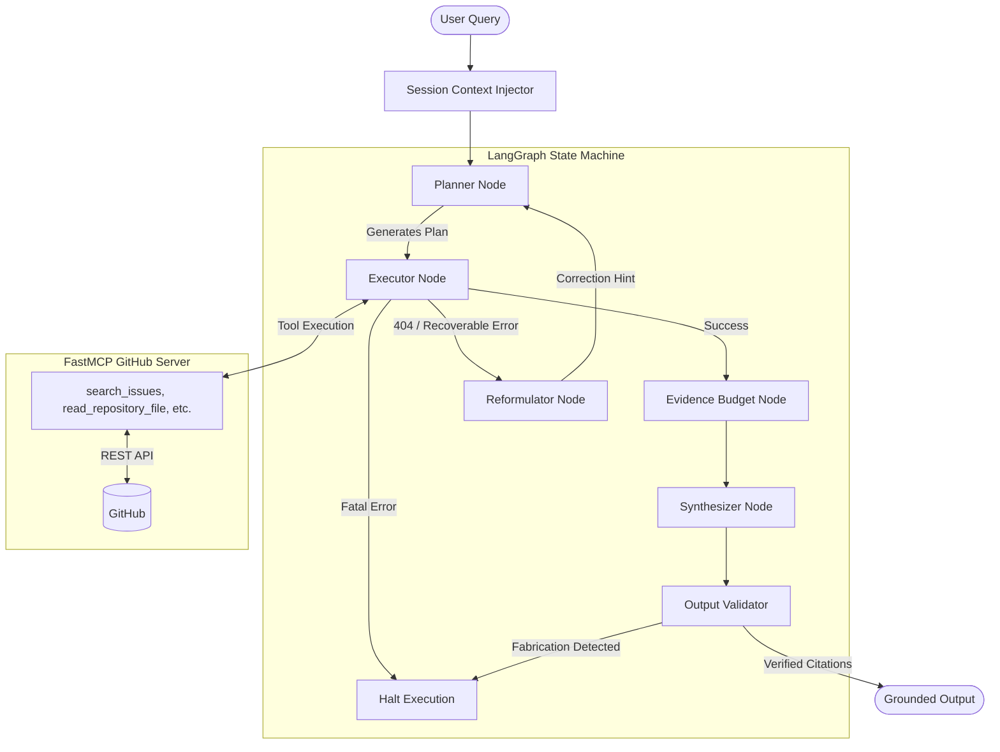

# ProjectEvidenceAI
**Agentic RAG over Live GitHub Data**

[](https://github.com/Vishwas/ProjectEvidenceAI/actions/workflows/ci.yml)

ProjectEvidenceAI is a resilient, fully autonomous agentic architecture designed to synthesize accurate insights from live GitHub repository data using the Model Context Protocol (MCP) and LangGraph.

## Why this exists
Retrieving reliable insights from dense software repositories is challenging for traditional RAG systems. Standard chunk-and-embed pipelines struggle with structured, deeply connected API graphs (issues, PRs, branch histories) and suffer from hallucination when files move or branch names differ (e.g., `main` vs. `master`). ProjectEvidenceAI introduces a deterministic, stateful, and self-correcting agent capable of navigating live repository APIs, catching access failures, dynamically reformulating plans, and strictly validating citations against retrieved evidence.

## Architecture



## Demo & Execution Flow
1. **Intake:** The query and `SessionContext` (e.g., repo owner/name) are embedded into an `AgentState`.
2. **Planning:** The LLM generates a strictly schema-compliant execution plan of tools to run.
3. **Execution & Recovery:** The Executor calls the GitHub MCP server. If a recoverable failure occurs, execution pauses, the Reformulator analyzes the failure, and injects a scoped hint to update the plan without losing prior context.
4. **Budgeting:** Successful payloads (PR metadata, file diffs) are deduplicated, sorted, and algorithmically truncated to fit within strict inference limits.
5. **Synthesis:** The Synthesizer drafts an answer heavily constrained by strict systemic rules, citing specific Source IDs and URLs.
6. **Validation:** A post-execution guardrail scans the draft for markdown citations, verifying each cited URL actually exists in the runtime `Evidence` array.

## Autonomous Recovery Example
The agent is capable of recovering from missing branches and files without user intervention. Here is a real tested scenario for `octocat/Hello-World`:
- **Initial Plan:** Read `README.md` on branch `main`.
- **Execution:** MCP tool returns `404 Not Found`.
- **Reformulator:** "The 'main' branch was not found in the 'Hello-World' repository. Try using the 'master' branch instead..."
- **Replanning:** Planner issues a localized replacement step for `master`.
- **Execution 2:** MCP tool returns `404 Not Found` again.
- **Reformulator:** "The repository likely does not have a README.md file at its root..."
- **Outcome:** The agent autonomously halts file reads and gracefully responds based on available evidence, having attempted max 3 resilient recovery steps.

## Engineering Decisions & Capabilities
- **State Machine Orchestration:** Uses LangGraph for cyclical execution, explicitly separating planning, executing, and reformulating nodes.
- **Model Context Protocol (MCP) Integration:** Direct, authenticated read-access to the GitHub API via a dedicated FastMCP server.
- **Self-Healing Execution:** A dedicated Reformulator node catches non-fatal execution errors and dynamically injects scoped correction hints to replace only the failed execution steps.
- **Deterministic Citation Validation:** Every generated citation is checked against URLs present in retrieved MCP evidence, with fabricated and mismatched citations rejected. This is an algorithmic guardrail, not an LLM check.
- **Deterministic Evidence Budgeting:** Uses deterministic, conservative evidence truncation (by pre-serializing massive MCP payloads) and bounded synthesis output to stay within low-cost provider token limits and prevent context window bloat.
- **Input Guardrails:** Validates allowable user inputs prior to execution, blocking prompt injection, secret extraction, and out-of-scope boundary bypasses deterministically.
- **Session Persistence:** Stateful checkpointing via LangGraph's Async SQLite saver allows true cross-turn continuity natively integrated with Streamlit.

## Evaluation & Metrics
- **Portfolio Metrics:** Verified against **45 deterministic tests**, up to 3 autonomous recovery attempts natively, fully typed Pydantic structures, and rigorous citation validations.
- **Deterministic Tests:** Ensures routing, guardrails, URL extraction, and failure classifications behave correctly using mocked MCP payloads.
- **Semantic Evaluation (Opt-in):** Uses DeepEval to measure context relevancy, groundedness, and adherence to LLM system rules. *(Note: A green semantic test means the pipeline successfully ran, but if API rate limits skip the validation, it doesn't guarantee semantic quality).*
- **Continuous Integration:** GitHub Actions workflow runs the deterministic test suite sequentially across **Python 3.11 and 3.12** on every push and PR to `main`.

## Project Structure
```text
ProjectEvidenceAI/
├── app.py                      # Main Streamlit UI entrypoint
├── src/
│   ├── agent/                  # LangGraph architecture (planner, executor, synthesizer, budget)
│   ├── guardrails/             # Deterministic input/output validation checks
│   └── mcp_server/             # FastMCP server bridging GitHub's REST API
├── scripts/                    # CLI testing and demo recovery scripts
└── tests/                      # 45+ deterministic and evaluation benchmarks
```

## Setup Instructions
```bash
python -m venv venv
# Linux/macOS
source venv/bin/activate
# Windows
.\venv\Scripts\Activate.ps1

pip install -r requirements.txt
cp .env.example .env
```
*Fill in your `GITHUB_TOKEN` and preferred LLM configuration inside `.env`.*

## Running the Application
To run the interactive Streamlit UI locally:
```bash
streamlit run app.py
```

## Running Tests
To run the full suite of 45 deterministic tests:
```bash
pytest -v
```
To run a dedicated terminal trace of the recovery mechanism (bypassing the UI):
```bash
python scripts/demo_recovery.py
```

## Known Limitations
- **LLM Rate Limits (Free-tier):** When using providers like Groq on a free tier, tokens-per-minute (TPM) can easily max out during aggressive multi-tool retrieval phases or rapid sequential testing. A strict `MAX_SYNTHESIS_INPUT_TOKENS` budget is implemented, but highly complex repositories may still encounter API 429s/413s.
- **File Parsing Limits:** Does not currently execute remote code, analyze arbitrary binary files, or natively parse multi-megabyte monolithic source files.

## Future Improvements
- **Semantic Code Search:** Integrate a vector store (e.g., Qdrant or Pinecone) alongside the MCP server to enable semantic searching across massive codebases without relying entirely on GitHub's native `is:issue` or exact-match file queries.
- **Multi-Repository Analysis:** Extend `SessionContext` to support querying across multiple interconnected repositories (e.g., frontend and backend repos) in a single plan.
- **Asynchronous Execution:** Run non-dependent plan steps (e.g., fetching issues and fetching PRs) concurrently in the Executor node to reduce overall time-to-insight.
